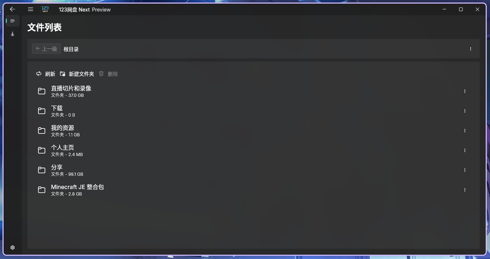

<p align="center">
  
</p>

<h1 align="center">Pan123 Next 🚀</h1>

<p align="center">
  <em>你的云盘，随叫随到</em>
  <br>
  
</p>

[](https://github.com/123panNextGen/pan123next/stargazers)
[](https://github.com/123panNextGen/pan123next/issues)
[](https://github.com/123panNextGen/pan123next/blob/main/LICENSE)
[](https://flutter.dev)
[](https://github.com/123panNextGen/pan123next/releases/latest)
[](https://github.com/123panNextGen/pan123next/releases)

---

一款使用 **Dart/Flutter** 编写的第三方 123云盘 桌面客户端，采用 **Fluent UI** 设计风格，支持多平台运行（Windows / macOS / Linux / Android）。

> ⚠️ 本项目仍在早期开发阶段，功能尚不齐全，可能存在较多问题。

## ✨ 功能

| 功能 | 状态 |
|------|------|
| 用户名/密码登录 | ✅ |
| 二维码登录 | 🚧 计划中 |
| 文件浏览（面包屑导航） | ✅ |
| 文件列表（回收站） | ✅ |
| 新建文件夹 | ✅ |
| 文件下载（分片并行下载） | ✅ |
| 断点续传 | ✅ |
| 下载进度 & 速度显示 | ✅ |
| 外部 URL 下载 | ✅ |
| 文件上传 | 💡 准备中 |
| 快速编辑 | 💡 准备中 |
| 主题切换（亮色/暗色） | ✅ |
| 强调色自定义 | ✅ |
| 下载路径设置 | ✅ |
| Windows / macOS / Linux | ✅ |
| Android APK | ✅ |

## 💬 社区与支持

- [GitHub Issues](https://github.com/123panNextGen/pan123next/issues) — 报告 Bug 或功能建议

## 📜 许可与免责声明

本项目基于 **GPL 3.0** 协议开源。

```
本项目为个人学习与技术研究目的开发，与 123 云盘官方无任何关联。
使用本项目即表示您理解并同意：
- 本软件按"原样"提供，不附带任何明示或暗示的担保
- 开发者不对因使用本软件造成的任何损失承担责任，包括但不限于
  数据丢失、账号封禁、服务中断等
- 您应自行遵守 123 云盘服务条款及适用法律法规
- 禁止将本项目用于任何商业用途
```

## ❤️ 贡献

欢迎提交 Pull Request 或 Issue！

本项目不提倡完全使用 AI 编写代码，使用 AI 工具时请确保您理解其生成的内容。

提交时请遵循 [Git 提交规范](doc/GitCommitMessageStyle.md)。

## ⭐ Star History

[](https://star-history.com/#123panNextGen/pan123next&Date)

---

<p align="center">Made with ❤️ by 123panNextGen Team</p>
<p align="center">⚡ Powered with <b>you</b></p>
